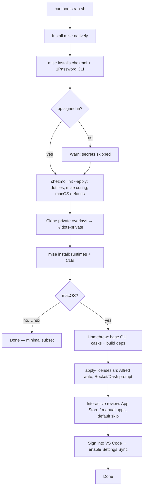

# dots

My machine setup, managed with [chezmoi](https://chezmoi.io). Replicates my macOS
(primary) and Linux (minimal) environment on a fresh machine and keeps them in sync.

## What's here

| Path                     | What it is                                                        |
| ------------------------ | ----------------------------------------------------------------- |
| `dot_*` / `dot_config/`  | Dotfiles (become `~/.zshrc`, `~/.config/...`, etc.) via chezmoi.   |
| `.chezmoi.toml.tmpl`     | Prompts on `init` for machine info (name, email, personal/work).  |
| `.chezmoiignore`         | Files chezmoi should not manage per-OS.                           |
| `install/`               | Install manifest + native bootstrap (see below).                  |
| `run_onchange_*`         | Curated macOS `defaults` tweaks (run automatically on change).     |

## Install source priority

Homebrew is a **last resort** (it gets heavy). Prefer, in order:

1. **mise** — runtimes + CLIs (`private_dot_config/mise/config.toml` → `~/.config/mise/`)
2. **direct download / vendor** — official vendor installers; the self-updating GUI
   apps use their official Homebrew casks, the rest are in `install/manual-apps.md`
3. **Mac App Store** — `mas`, interactive/opt-in (`install/mas.txt`)
4. **Homebrew** — GUI casks + build deps nothing above handles (`install/Brewfile`, kept small)

## Fresh machine (one command)

```sh
sh -c "$(curl -fsLS https://raw.githubusercontent.com/jjcarstens/dots/main/install/bootstrap.sh)"
```

The bootstrap (native `sh`, no dependencies):

1. Installs **mise** natively (`curl`), then `mise` installs **chezmoi** + **1Password CLI**.
2. `chezmoi init --apply jjcarstens/dots` — writes dotfiles, app config, mise config, and
   applies the macOS `defaults` tweaks; injects licenses/secrets from 1Password.
3. `mise install` — runtimes + CLIs from the managed mise config.
4. macOS: **Homebrew** (last resort) installs the GUI casks + build deps in `install/Brewfile`.
5. **Interactive review** — asks yes/no for each *optional* app (App Store `mas.txt`, manual
   apps); defaults to skip so restricted/company machines decline cleanly.

> **VS Code** config is *not* managed here — it's handled by VS Code's built-in Settings
> Sync. On a fresh machine, open VS Code, sign in, and enable Settings Sync to pull your
> settings, keybindings, and extensions.

## Daily sync workflow

Everything (public dotfiles + the private overlay) syncs with one alias, defined in `.zshrc`:

```sh
dots sync      # re-add local changes, commit + push BOTH repos
dots update    # on another machine: pull + apply both repos
```

Under the hood that's just chezmoi + git:

```sh
chezmoi edit ~/.zshrc      # edit a managed file
chezmoi re-add             # pull local changes back into the repo
chezmoi cd && git commit -am "..." && git push   # publish
chezmoi update             # on another machine: git pull + apply
```

Machine/employer-specific bits (work shell functions, internal SSH hosts) live in a
separate **private** repo cloned to `~/.dots-private`, referenced directly by the public
`.zshrc` / `.ssh/config`. `dots sync`/`dots update` handle both repos together.

`chezmoi diff` previews what an apply would change. Nothing secret is committed —
secrets and app licenses are pulled from 1Password at apply-time.

## Extending this setup

As the setup grows, each kind of change has one obvious home:

| I want to add…                          | Put it here                                                        |
| --------------------------------------- | ----------------------------------------------------------------- |
| A CLI / language runtime                | `private_dot_config/mise/config.toml` (mise-first)                |
| A GUI app with an official cask         | `install/Brewfile`                                                |
| An App Store app (opt-in)               | `install/mas.txt`                                                 |
| An app with no cask/download            | `install/manual-apps.md`                                          |
| A new dotfile                           | `chezmoi add ~/.thing` (becomes `dot_thing`)                      |
| A machine-specific value in a dotfile   | make it a `.tmpl`, read from `.chezmoi` data                      |
| A secret or paid-app license            | store in 1Password, reference via `onepasswordRead` / a template  |
| A work/client git identity              | add a `[[data.work]]` block to `~/.config/chezmoi/chezmoi.toml`   |
| A macOS system tweak                    | `run_onchange_darwin-macos-defaults.sh.tmpl`                      |
| A **sensitive** shell func / SSH host   | the private `~/.dots-private` repo (`zshrc.local` / `ssh/config.local`) |
| Something Linux- or macOS-only          | guard it with `{{ if eq .chezmoi.os "…" }}` in a `.tmpl`          |

After any change: `dots sync`. On another machine: `dots update`.

## Bootstrap flow



