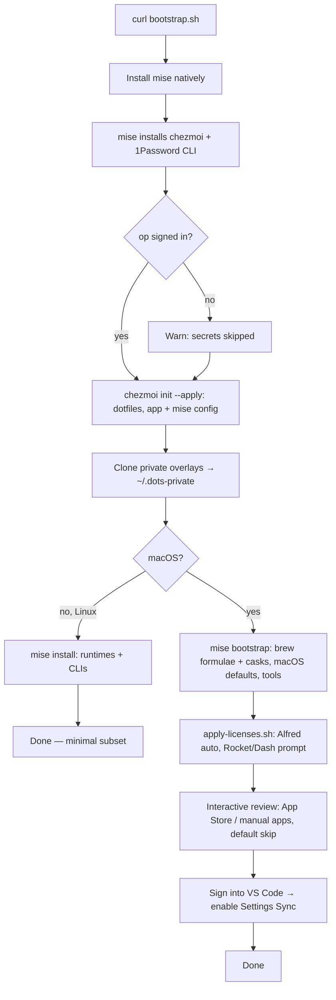

# dots

My machine setup, managed with [chezmoi](https://chezmoi.io). Replicates my macOS
(primary) and Linux (minimal) environment on a fresh machine and keeps them in sync.

> **Where do I change things?** One place to look: [Extending this setup](#extending-this-setup)
> — a row per kind of change telling me which file to edit. After any change: `dots sync`.

## What's here

| Path                     | What it is                                                        |
| ------------------------ | ----------------------------------------------------------------- |
| `dot_*` / `dot_config/`  | Dotfiles (become `~/.zshrc`, `~/.config/...`, etc.) via chezmoi.   |
| `.chezmoi.toml.tmpl`     | Prompts on `init` for machine info (name, email, personal/work).  |
| `.chezmoiignore`         | Files chezmoi should not manage per-OS.                           |
| `install/`               | Install manifest + native bootstrap (see below).                  |
| `private_dot_config/mise/config.toml` | Tools + `[bootstrap.*]`: brew formulae/casks, macOS defaults. |

## Install source priority

Homebrew formulae/casks are installed **by mise** (no `brew` binary needed), so
there's no separate Homebrew step. Prefer, in order:

1. **mise** — runtimes + CLIs via `[tools]`, and GUI apps + build deps via
   `[bootstrap.packages]` (`private_dot_config/mise/config.toml` → `~/.config/mise/`)
2. **direct download / vendor** — official vendor installers for apps with no
   mise-installable cask (`install/manual-apps.md`)
3. **Mac App Store** — `mas`, interactive/opt-in (`install/mas.txt`)

## Fresh machine (one command)

```sh
sh -c "$(curl -fsLS https://raw.githubusercontent.com/jjcarstens/dots/main/install/bootstrap.sh)"
```

The bootstrap (native `sh`, no dependencies):

1. Installs **mise** natively (`curl`), then `mise` installs **chezmoi** + **1Password CLI**.
2. `chezmoi init --apply jjcarstens/dots` — writes dotfiles, app config, and mise config;
   injects licenses/secrets from 1Password.
3. macOS: `mise bootstrap` installs brew formulae + casks (mise pours them directly, no
   Homebrew install), writes the macOS `defaults`, then installs runtimes + CLIs from `[tools]`.
   Linux: brew/cask entries are macOS-guarded, so it just installs the tools.
4. macOS: **paid-app licenses** from 1Password (`apply-licenses.sh`).
5. **Interactive review** — asks yes/no for each *optional* app (App Store `mas.txt`, manual
   apps); defaults to skip so restricted/company machines decline cleanly.

> **VS Code** config is *not* managed here — VS Code's built-in Settings Sync owns it.
> On a fresh machine: open VS Code, sign in, enable Settings Sync.

## Daily sync workflow

Everything (public dotfiles + the private overlay) syncs with one alias, defined in `.zshrc`:

```sh
dots sync      # re-add local changes, commit + push BOTH repos
dots update    # on another machine: pull + apply both repos
```

Under the hood that's just chezmoi + git:

```sh
chezmoi edit ~/.zshrc      # edit a managed file
chezmoi re-add             # pull local changes back into the repo
chezmoi cd && git commit -am "..." && git push   # publish
chezmoi update             # on another machine: git pull + apply
```

Machine/employer-specific bits (work shell functions, internal SSH hosts) live in a
separate **private** repo cloned to `~/.dots-private`, referenced directly by the public
`.zshrc` / `.ssh/config`. `dots sync`/`dots update` handle both repos together.

`chezmoi diff` previews what an apply would change. Nothing secret is committed —
secrets and app licenses are pulled from 1Password at apply-time.

## Extending this setup

Each kind of change has one home:

| I want to add…                          | Put it here                                                        |
| --------------------------------------- | ----------------------------------------------------------------- |
| A CLI / language runtime                | `private_dot_config/mise/config.toml` `[tools]` (mise-first)      |
| A GUI app or build dep (brew formula/cask) | `private_dot_config/mise/config.toml` `[bootstrap.packages]` (or `mise bootstrap packages use brew-cask:<name>`) |
| An App Store app (opt-in)               | `install/mas.txt`                                                 |
| An app with no mise-installable cask    | `install/manual-apps.md`                                          |
| A new dotfile                           | `chezmoi add ~/.thing` (becomes `dot_thing`)                      |
| A machine-specific value in a dotfile   | make it a `.tmpl`, read from `.chezmoi` data                      |
| A secret or paid-app license            | store in 1Password, reference via `onepasswordRead` / a template  |
| A paid app that needs license activation | add its activation to `install/apply-licenses.sh`                |
| Your primary work git identity          | `chezmoi init` prompts for it; or re-run `chezmoi init` to fill it in later |
| An *additional* work/client git identity | add another `[[data.work]]` block to `~/.config/chezmoi/chezmoi.toml`, then `chezmoi apply` |
| A macOS system tweak                    | `private_dot_config/mise/config.toml` `[bootstrap.macos.*]`       |
| A zsh completion for a CLI              | add its name to `install/completions.txt` (or just drop `_<exe>` in `~/.zsh/completions` — it's auto-tracked on next apply) |
| A **sensitive** shell func / SSH host   | the private `~/.dots-private` repo (`zshrc.local` / `ssh/config.local`) |
| Something Linux- or macOS-only          | guard it with `{{ if eq .chezmoi.os "…" }}` in a `.tmpl`          |

After any change: `dots sync`. On another machine: `dots update`.

## Bootstrap flow



